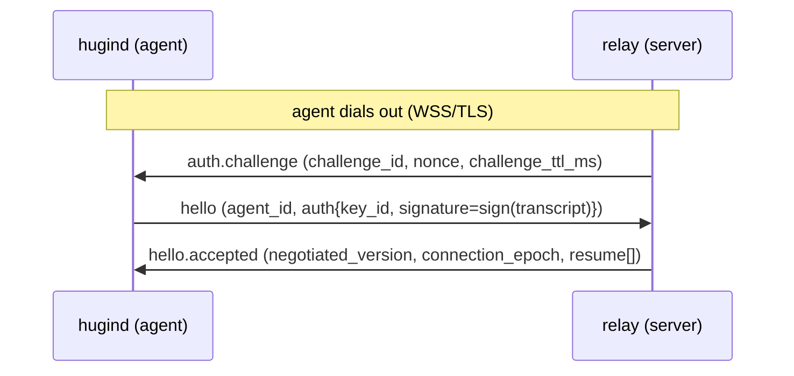
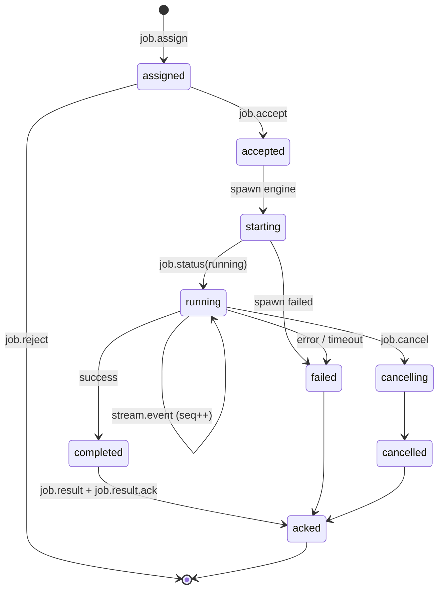
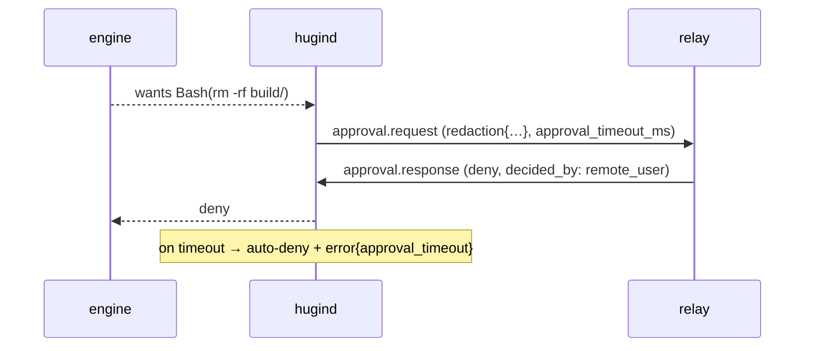

# Hugin Agent — Wire Protocol v1 (STRAWMAN, rev 1.3)

WSS JSON contract between the local daemon (`hugind`, **agent**) and the cloud
relay (**server**). A **proposal for review**, not a frozen contract. rev 1.3
folds in two cloud-side reviews (cloud team + Codex) — see [CHANGELOG](../CHANGELOG.md).

- **SSOT:** [`v1/messages.ts`](v1/messages.ts) (zod). Both codebases import it.
- **Runnable spec:** `npm run protocol:check` — 23/23 messages + negotiation,
  strict-field, safe-integer, and direction/phase checks.
- **TLS is mandatory.** The transport protects `server_time` and frames in flight.

## Design principles

| # | Principle |
|---|-----------|
| 1 | **Outbound-only** — agent dials out; no inbound ports. |
| 2 | **At-least-once + idempotent** — `seq`+`event_id` dedupe; never exactly-once. |
| 3 | **Lease fencing** — `lease_id` is the current-generation token on **every** attempt-scoped message, **both directions**. Rotates on `lease.granted`. |
| 4 | **Digest-acked completion** — `job.result` → `job.result.ack{result_digest}`. |
| 5 | **Authenticated handshake** — `auth.challenge` → Ed25519-signed `hello`. |
| 6 | **Relative durations are authoritative** — `*_ms`; ISO times are audit/display only. |

## Agreed operational values

Both sides enforce these (exported as `LIMITS` in the SSOT):

| Concern | Value |
|---------|-------|
| Lease TTL | 120s default (30–300s); reassign only after expiry **+30s grace** |
| Heartbeat | 15s interval; suspect @3 misses; dead @4 misses or 60s. **Dead ≠ reassign** — reassignment needs lease expiry + grace, never heartbeat alone. |
| Approval | 300s default, 900s hard max; late responses ignored + audited |
| Stream ack flush | first of 1s / 64 events / 256 KiB; ack only after durable commit |
| Flow caps | frame ≤1 MiB; per-attempt unacked ≤8 MiB or 1024 events; per-conn ≤32 MiB |
| Nonce | 32 random bytes base64url, TTL 60s, globally single-use |

## Message catalog

Every attempt-scoped message (both directions) carries `lease_id`.

| Message | Dir | Purpose |
|---------|-----|---------|
| `auth.challenge` | s2a | Nonce + `challenge_ttl_ms` to sign. |
| `hello` | a2s | `agent_id` + Ed25519 `auth{key_id, signature}` + capabilities + `active_jobs` + `pending_results`. |
| `hello.accepted` | s2a | `negotiated_version`, **`connection_epoch`**, resume directives. |
| `hello.rejected` | s2a | version/auth/`expired_challenge` refusal. |
| `lease.renew` / `lease.granted` / `lease.revoke` | a2s / s2a / s2a | Fencing: renew before expiry; `lease.granted` issues the **next** `lease_id` + `lease_ttl_ms`. |
| `job.assign` | s2a | Assign attempt (engine, workspace, bounded prompt, policies, limits). **No `session_id`.** |
| `job.accept` / `job.reject` | a2s | Take, or refuse (`policy_violation` when policy exceeds local max). |
| `stream.event` | a2s | Normalized event (`seq`, `event_id`, core `kind` enum). |
| `stream.ack` | s2a | Cumulative durable ack. |
| `approval.request` | a2s | Gated tool ask (`redaction{…}`, `approval_timeout_ms`). |
| `approval.response` | s2a | allow/deny + `decided_by` (**remote-only**). |
| `job.status` | a2s | Lifecycle transition. |
| `job.result` | a2s | Terminal result. |
| `job.result.ack` | s2a | Confirms the **payload** is durable (`result_digest`). |
| `job.cancel` | s2a | Cancel an attempt (carries `lease_id`). |
| `heartbeat` | both | Liveness + `capacity`. |
| `agent.draining` / `capabilities.update` | a2s | Lifecycle. |
| `nack` / `error` | both | Protocol reject / runtime error. |

## Handshake

`signature` covers the **canonical transcript** (`challenge_id | nonce |
agent_id | protocol_version | alg` + domain separation + tenant binding), **not
the bare nonce** — defined byte-for-byte in
[`docs/auth-pairing-spec.md`](../docs/auth-pairing-spec.md). The server resolves
`agent_id` + `key_id` → device public key (registered at pairing), checks the
single-use nonce within its TTL, and assigns a `connection_epoch`. A newer
`hello` fences any older connection for the same `agent_id`.

## Job lifecycle

`final_status` ∈ {success, error, cancelled, timeout}: `completed→success`,
`cancelled→cancelled`, `failed→error|timeout`. A refused *assignment* ends at
`job.reject`, never here. `active_jobs` may only carry **non-terminal** status;
terminal results travel through `pending_results`.

## Lease & reliability

- `lease.granted` rotates `lease_id`; the agent uses the new token on all
  subsequent attempt-scoped messages. To avoid false-nacking messages already in
  flight during rotation, the server accepts **both** old and new `lease_id` for
  a short overlap window (≥ one RTT), retiring the old one once a message bearing
  the new token arrives or the window elapses (`stale_lease` thereafter). The
  agent stops the engine locally when its lease is lost/revoked (**local
  fencing** — the wire can't stop a partitioned process).
- `seq=1,2,3…` per attempt, persisted to local SQLite before send; cumulative
  `stream.ack` (server guarantees per-`(job,attempt)` in-order durable storage).
- Backpressure: pause reading the engine's stdout when unacked bytes hit the cap.
- On reconnect, `active_jobs` + `pending_results` (with `result_digest`,
  `result_size`, `last_emitted_seq`) drive `resume[]`:
  `resume_from` / `resend_result` / `ack_pending` / `abandon`.

## Approval

> **Local gate:** a remote `allow` is necessary, not sufficient, for high-risk
> tools — escalation also needs local user presence. `decided_by` is
> remote-only; the server can't assert `local_user`.
>
> **Local maximum policy:** if `job.assign` requests `sandbox`/`approval_policy`
> beyond the daemon's configured ceiling, the agent **rejects** with
> `job.reject{policy_violation}` — never a silent clamp (cloud and daemon must
> agree on the effective mode).
>
> **Bridge contract:** Claude Code's prompt tool expects `{behavior, updatedInput}`.
> The wire has no `updated_input`; the daemon caches the original input and
> replays `updatedInput = originalInput` on a remote `allow`. Restart between
> request and response → **fail closed**.
>
> **Isolation (spike finding):** the daemon must run the engine with an isolated
> permission config (don't inherit the user's `~/.claude` allow-list/`dontAsk`,
> which disables the gate) while preserving auth. See
> [`spikes/approval-prompt-tool`](../spikes/approval-prompt-tool/README.md).

## Hardening (enforced in the schema)

- **Strict objects** — unknown top-level fields rejected.
- **Safe integers** — counters bounded to `2^53-1` (cross-language JSON safety).
- **Bounded strings/arrays** — every id/text/path/array capped.
- **Direction + phase** — `validateInbound()` enforces `DIRECTION` + pre-auth
  handshake gating (the constant alone is not enforcement).
- **Workspace canonicalization is normative** — `repo_root`/`cwd` must be
  realpath'd, symlink-escapes and out-of-root `cwd` rejected, root allowlisted.

## Versioning

Prerelease/draft → exact match; stable → identical MAJOR. Strict-semver fields;
malformed/empty rejected. See `negotiateVersion()`.

## Open questions

### Resolved in rev 1.1–1.3
- ✅ Auth proof, Ed25519-only, `key_id`, 32-byte single-use nonce, `*_ms` TTLs.
- ✅ Lease fencing on all attempt messages (both directions) + rotation + `connection_epoch`.
- ✅ Terminal-result durability — `result_digest`/`result_size` + `resend_result`.
- ✅ `session_id` cross-job leak — field removed (engine resume out of scope).
- ✅ `decided_by` spoofing — remote-only enum.
- ✅ Safety downgrade — local-max policy → reject (`policy_violation`).
- ✅ Strict fields, safe integers, direction/phase enforcement, semver validation.

### Deferred to the auth/pairing security spec
- Canonical signing bytes (encoding, domain separation, tenant/server binding).
- Pairing/registration, `agent_id` minting, key rotation/revocation, lost-device.

### Still open (cloud-team agreement before freeze)
1. Per-job credit-window flow control (Phase 2; static caps + `capacity` for now).
2. Event `kind` core enum final membership before adapters lock.
3. `connection_epoch` semantics on multi-region relays (cross-POP).
