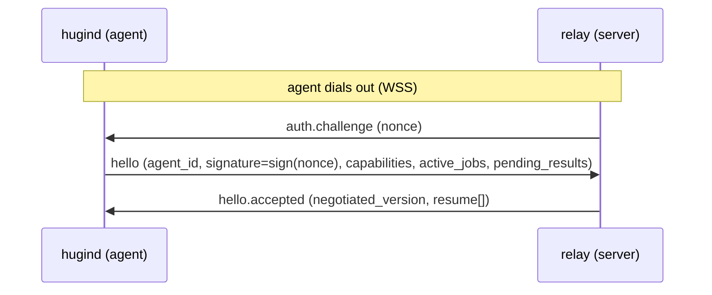
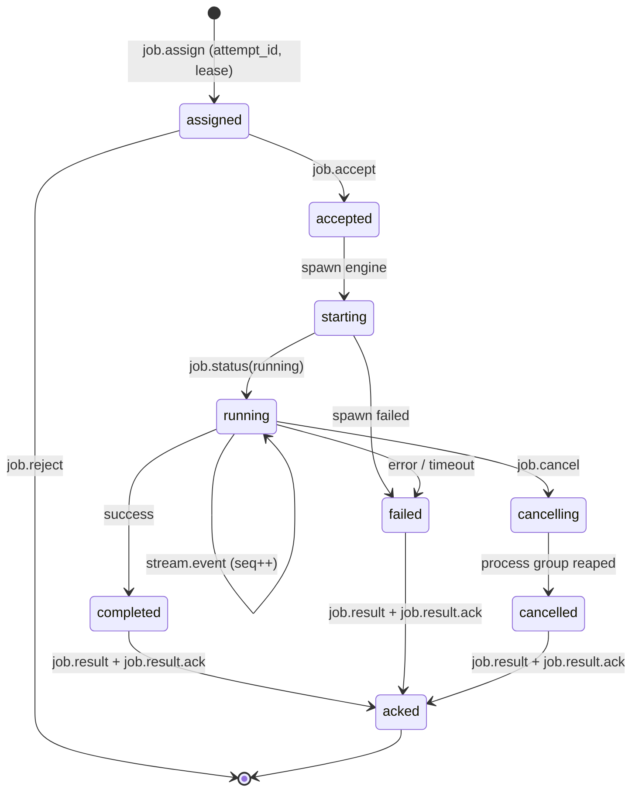
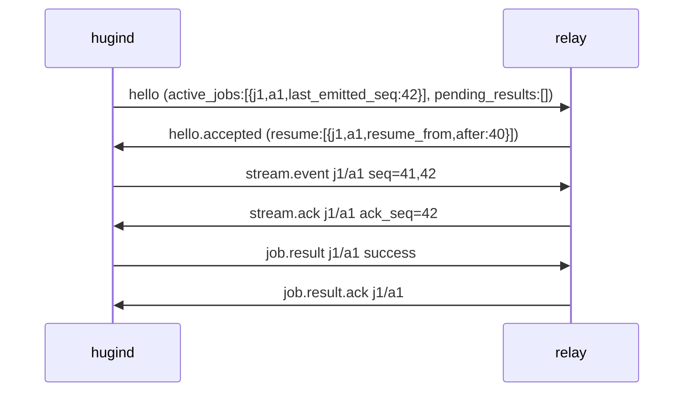
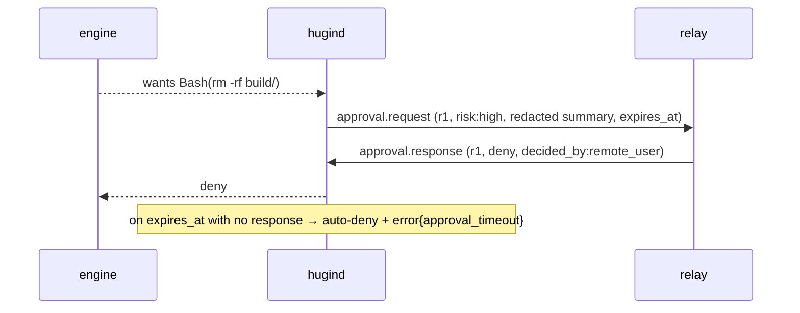

# Hugin Agent — Wire Protocol v1 (STRAWMAN, rev 1.2)

WSS JSON contract between the local daemon (`hugind`, **agent**) and the cloud
relay (**server**). This is a **proposal for review**, not a frozen contract —
see [Open questions](#open-questions). rev 1.1 folds in the first cloud-side
review (see [CHANGELOG](../CHANGELOG.md)).

- **SSOT:** [`v1/messages.ts`](v1/messages.ts) (zod). Both codebases import it;
  the cloud side can `z.toJSONSchema(Message)` or codegen from it.
- **Runnable spec:** `npm run protocol:check` validates one sample of every
  message type (23/23) + version negotiation.

## Design principles

| # | Principle | Why |
|---|-----------|-----|
| 1 | **Outbound-only** | Agent dials out; no inbound ports. NAT/firewall friendly. |
| 2 | **At-least-once + idempotent**, not exactly-once | `seq`+`event_id` let the server dedupe. |
| 3 | **Lease-based ownership** | Reconnect/reassign mint a new `attempt_id`; stale attempts are nacked, so a job never runs twice silently. |
| 4 | **Explicit, acked completion** | `job.result` is authoritative and is confirmed by `job.result.ack` so the agent can GC. |
| 5 | **Versioned + authenticated handshake** | Server `auth.challenge` → signed `hello`. No job flows until the device key is proven. |

## Message catalog

| Message | Dir | Purpose |
|---------|-----|---------|
| `auth.challenge` | s2a | Server's first frame: a nonce to sign. |
| `hello` | a2s | Identity + **signature over the nonce** + capabilities + `active_jobs` + `pending_results`. |
| `hello.accepted` / `hello.rejected` | s2a | Negotiated version + resume directives, or version/auth refusal. |
| `lease.renew` | a2s | Ask to extend the current attempt's lease. |
| `lease.granted` | s2a | New `lease_expires_at`. |
| `lease.revoke` | s2a | Server pulls ownership (agent must stop the attempt locally). |
| `job.assign` | s2a | Assign an attempt under a lease (engine, workspace, **bounded** prompt, policies, limits). |
| `job.accept` / `job.reject` | a2s | Agent takes or refuses the attempt. |
| `stream.event` | a2s | Normalized NDJSON event with monotonic `seq` + `event_id`. |
| `stream.ack` | s2a | Cumulative ack: server durably stored everything ≤ `ack_seq`. |
| `approval.request` | a2s | Ask before a gated tool runs (redacted summary, **`expires_at`**). |
| `approval.response` | s2a | allow/deny + `decided_by` (enum). **No server-rewritten input.** |
| `job.status` | a2s | Lifecycle transition. |
| `job.result` | a2s | Terminal result (`final_status`, `exit_code`, `head_sha`, stats). |
| `job.result.ack` | s2a | Server stored the result; agent may GC the attempt. |
| `job.cancel` | s2a | Cancel an attempt; `grace_ms` before process-group SIGKILL. |
| `heartbeat` | both | Liveness; a2s beats carry `capacity` (backpressure hint). |
| `agent.draining` | a2s | Graceful shutdown/update notice. |
| `capabilities.update` | a2s | Engines/roots changed mid-connection. |
| `nack` / `error` | both | Protocol-level reject / runtime error. |

## Handshake

The server resolves `agent_id` → the device public key registered at pairing,
verifies the signature, and only then accepts. A bad/absent signature →
`hello.rejected{bad_signature|unauthorized}`.

**Signed transcript, not the bare nonce:** `signature` covers
`challenge_id | nonce | agent_id | protocol_version | alg`, so a captured
`(nonce, sig)` pair can't be replayed against a different identity or version.
`nonce` is ≥256-bit single-use with a TTL (`auth.challenge.expires_at`); the
server tracks spent nonces. **TLS is mandatory** — the transport (not the JSON
schema) protects `server_time` and the frames in flight.

## Job lifecycle

Every terminal state emits a `job.result` and is GC'd only after
`job.result.ack`. `final_status` ∈ {success, error, cancelled, timeout}:
`completed→success`, `cancelled→cancelled`, `failed→error|timeout`. A refused
*assignment* never reaches here — it ends at `job.reject`. (`JobStatus` carries
`cancelled`; `timeout` is a `failed`-state result reason, not a status.)

## Lease lifecycle

A lease binds **one attempt** to the agent that owns it.

- `job.assign` carries `lease_id` + `lease_expires_at`.
- The agent extends it with `lease.renew` → `lease.granted` before expiry.
- The server can pull it with `lease.revoke`; the agent MUST then stop the
  attempt locally.
- If the agent disconnects past expiry, the server MAY mint a **new
  `attempt_id`** and reassign. A resurfacing old attempt is rejected with
  `nack{stale_lease}`.
- **Invariant:** at most one *live* attempt per `job_id`.

> ⚠️ The wire can reject a stale attempt's *messages*, but it cannot stop a
> partitioned old agent **process** from running locally. The daemon needs
> **local lease fencing** (stop the engine when its lease is lost). This is a
> daemon responsibility, called out here so it isn't forgotten.

## Reliability: seq / ack / replay

1. Agent assigns `seq = 1,2,3…` per attempt and **persists each event to local
   SQLite before sending**.
2. Server sends `stream.ack{ack_seq}` cumulatively (assumes **in-order durable
   storage** — see Open #2).
3. Backpressure: if unacked bytes exceed a cap, the agent pauses reading the
   engine's stdout; `heartbeat.capacity` advertises headroom.
4. On reconnect, `hello.active_jobs[].last_emitted_seq` + `pending_results[]`
   (each carrying `final_status`) tell the server where the agent is; it replies
   in `hello.accepted.resume[]` with `resume_from(resume_after_seq)`, `abandon`,
   or `ack_pending` (server already stored that terminal result → GC it). The
   agent durably stores the full `job.result` payload locally so it can re-send
   on `resume_from` — `pending_results` is only the index into that store.

## Approval flow

> **Local gate (security invariant):** a remote `allow` is **necessary, not
> sufficient** for high-risk tools. Write/network/shell escalation also requires
> local user presence — otherwise a compromised orchestrator self-approves. The
> server cannot rewrite tool input (no `updated_input`); allow/deny only.
>
> **Bridge contract (claude `--permission-prompt-tool`):** the prompt tool
> expects `{behavior:"allow", updatedInput}` / `{behavior:"deny"}`. Since the
> wire has no `updated_input`, the daemon caches the *original* tool input when
> it sends `approval.request`, and on a remote `allow` replays
> `updatedInput = originalInput` to the engine. If the daemon restarts between
> request and response the cached input is lost and the attempt **fails closed**.
>
> **Spike finding:** the daemon must run the engine with an *isolated*
> permission config (don't inherit the user's `~/.claude` allow-list/`dontAsk`,
> which silently disables the gate) **while preserving auth**. See
> [`spikes/approval-prompt-tool`](../spikes/approval-prompt-tool/README.md).

## Versioning

- **Prerelease/draft** (e.g. `1.1.0-draft`) → **exact match** required.
- **Stable** → identical MAJOR is compatible (additive minor/patch only).
- Mismatch ⇒ `hello.rejected{unsupported_version}`. See `negotiateVersion()`.

## Open questions

### Resolved in rev 1.1–1.2
- ✅ **Auth proof** — `auth.challenge` + signed `hello` over a transcript
  (challenge_id|nonce|agent_id|version|alg), ≥256-bit single-use nonce + TTL.
- ✅ **`updated_input` injection** — removed; allow/deny only (bridge contract
  for reconstructing `updatedInput` is documented above).
- ✅ **Result durability** — `job.result.ack` + `hello.pending_results`
  (`final_status`) + `ack_pending` reconnect directive.
- ✅ **Lease fencing (wire side)** — `lease.renew`/`granted`/`revoke`; local
  fencing remains a daemon duty (noted above).
- ✅ **Version negotiation** — prerelease-exact + strict-semver input validation
  (empty/malformed rejected).
- ✅ **State-machine consistency** — `JobStatus.cancelled` added; `FinalStatus`
  trimmed to {success, error, cancelled, timeout}.

### Still open (need cloud-team agreement before freeze)
1. **Lease renewal cadence** — how often must `lease.renew` fire; what grace
   does the server give before reassigning?
2. **Ack granularity** — cumulative `ack_seq` assumes in-order durable storage.
   Confirm, or do we need selective ack?
3. **Approval deadline ownership** — `expires_at` is set agent-side; should the
   server also be able to extend/cancel it?
4. **Multiplexing flow-control** — `heartbeat.capacity` is a coarse hint. Do we
   need a per-job window for concurrent jobs?
5. **Normalized event schema** — lock a closed enum of `event.kind` now, or keep
   it open while the claude/codex adapters settle?
6. **Clock skew** — `*_expires_at` are absolute ISO times. Prefer relative
   `*_ms` durations to dodge agent/server drift?
7. **Auth specifics** — signature alg(s) to support, nonce lifetime, replay
   protection, key rotation/revocation flow.
8. **Heartbeat liveness** — server-side timeout rule for declaring an agent dead.
